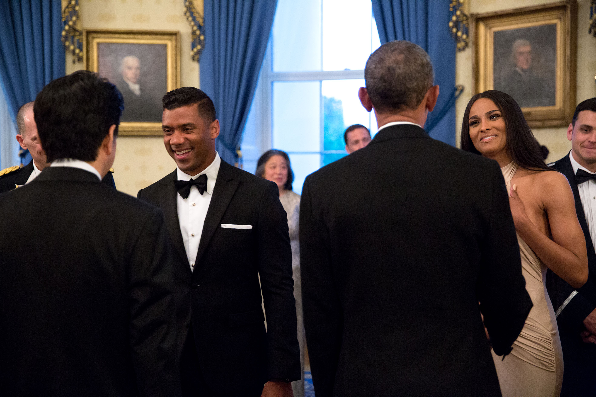

# Ciara



A tiny Rust repository for demonstrating a custom [bors](https://github.com/rust-lang/bors) setup.
The theme is Ciara's [**Level Up**](https://www.youtube.com/watch?v=Dh-ULbQmmF8): every change enters the merge queue, runs CI, and levels up `main` only after the checks pass.

## Run it

```console
cargo run
```

Expected output:

```text
Ciara says: level up!
```

## Bors demo

The repository follows the demo plan:

- `rust-bors.toml` enables the merge queue and approval labels.
- CI runs for `automation/bors/try` and `automation/bors/auto`.
- The merge-only branches are intentionally excluded from CI triggers.

Once the GitHub App is installed with push access, open a pull request and try:

```text
@bors try
@bors r+
```

## Image credit

Ciara and Russell Wilson greeting President Barack Obama and Prime Minister Shinzo Abe at the White House, photographed by Pete Souza. The unmodified image is a U.S. government work in the [public domain](https://commons.wikimedia.org/wiki/File:Obama_%26_Abe_Greet_Russell_Wilson_%26_Ciara_2015.jpg).

This project is an unaffiliated technical demo. Ciara does not endorse it.
